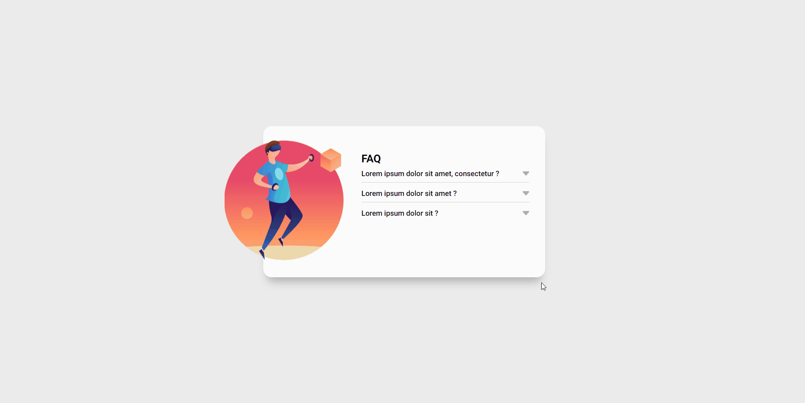
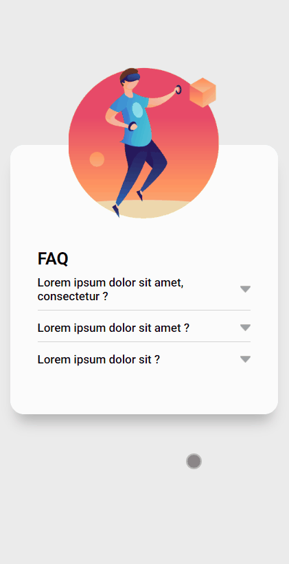

# Módulo Intermediário de JavaScript - Exercício 6

## Visão geral

### Exercício 
Crie um acordeón conforme layout do figma Exercício 2

#### Pontos de atenção

- ao clicar em uma pergunta deve acontecer uma animação de acordeon para abrir o item e mostrar o texto escondido, e a seta deve mudar de cor.
- ao clicar em um item para abri-lo todos os outros itens devem ser fechados.
- Referência do que é um efeito acordeon https://www.netflix.com/br/ na seção "Perguntas Frequentes".

**IMPORTANTE:** Esse site é um exercício do curso e ele não foi pensado em responsividade ou em ser postado, o que importa nele é a interação do JS e não o site em sí. Eu só achei ele legal e decidi postar, portanto essa "responsividade" feita foi só uma 'gambiarra' para o site poder funcionar em telas de celular também, dito isso fique a vontade para seguir em frente ^^.

## Preview 🎴

### Desktop Preview


### Mobile Preview


### Links 🔗

- Site: [Live Site](https://ramon-alvez.github.io/DevQuest-JS-Acordeon/)
- Repositório: [GitHub](https://github.com/Ramon-Alvez/DevQuest-JS-Acordeon)

### Figma 🎨


---

## Processo 🧱

### O que eu aprendi 📚

Estou muito feliz de ter conseguido chegar até o final do módulo intermediário de JS do curso DevQuest, sobre esse desafio ele foi um pouco mais complicado que os outros devido ao tempo que eu fiquei sem praticar devido a alguns compromissos (precisei trabalhar em casa e resolver assuntos externos) que eu tive nos ultimos 2/3 meses, sendo sincero a parte de JS eu fiz uma gambiarra da primeira vez, não gostei e fui tentar novamente agora e esse foi o resultado, cheguei quase até o final sozinho, somente em uma coisa eu não estava conseguindo fazer e pedi ajuda ao chat gpt, mas isso eu vou explicar abaixo na comparação dos dois códigos. 

Novamente, estou fazendo isso para deixar registrado a minha solução e evolução, estou sempre aberto a dicas. 

### Desafios 🏋️

Como dito anteriormente eu fiz o código duas vezes, a primeira eu optei por utilizar o input checkbox pois na minha cabeça seria mais fácil utilizar o parâmetro "checked" para fazer dar certo, mas acabou dando na mesma.

**Obs:** Minha ideia inicial foi utilizar o Radio por só poder manter um ativo (o que resolvia metade do problema), mas ele não podia ser desativado uma vez ativo, então ele foi descartado pelo checkbox.

O código ficou funcional, mas o html e o css foi uma gambiarra, e o JS que eu estava relembrando ficou tenebroso também, eu não fiquei muito contente com o resultado mas decidi postar mesmo assim, afinal eu estava desde novembro sem postar nada. 

No quesito HTML e CSS eu estou tranquilo, embora eu penei um pouco na responsividade do 2 código por vacilo, mas consegui resolver. 

Já no JS a história foi outra, eu revi as aulas falando sobre funções e manipulação do DOM e consegui desenvolver parte do código sozinho: 

Depois eu criei o que seria a função atual:

``` JavaScript

let setas = document.querySelectorAll("img[alt = 'seta']");
let buscarInfo = document.querySelectorAll('article')

setas.forEach((item, indice) => {
    item.addEventListener('click', () => {
        if (item.classList.contains('inativo')) {
            item.classList.replace('inativo', 'ativo')
            item.src = "src/images/seta-aberta.png"
            buscarInfo[indice].classList.remove('esconder')

        } else if (item.classList.contains('ativo'))  {
            item.classList.replace('ativo', 'inativo')
            item.src = "src/images/seta.png"

            buscarInfo[indice].classList.add('esconder')
        }
    })
    
});


```

Fiz esse código aos poucos, primeiro fiz o algoritmo reconhecer as setas e qual delas eu estava clicando, depois eu joguei uma condicional para poder ativar e desativar elas quando eu clicasse. 

Umas das melhorias que eu fiz no código foi trocar o classList.add e classList.remove pelo classList replace: 

``` JavaScript
// antes
item.classList.add('inativo')
item.classList.remove('ativo')

// depois
item.classList.replace('inativo', 'ativo')

```

E por mais que dê para usar o else ali, após aquela ultima experiência onde o else estava bugando o código eu decidi escrever a condição só por garantia.

Enfim até ai eu cheguei sozinho, mas estava faltando algo, os botões estavam funcionando mas eu precisava de somente um ativo por vez, e do jeito que o código estava eu poderia deixar até todos os botões ativos. 

Eu sabia o que fazer, precisava que os demais itens do array que não fossem o selecionado (o que nós clicamos) não tivessem a classe ativa, até pensei em fazer uma função que resolvia isso, mas no meu pensamento limitado eu não consegui chegar a uma resposta. 

Conversei um pouco com alguns colegas de um grupo de whatsapp de programação do qual eu faço parte e um deles até me deu uma ideia interessante, mas não cabia nesse caso (que era o switch-case), decidi terminar o front enquanto pensava numa solução para isso.

Ao terminar a parte visual eu ainda não tinha chegado a uma resposta sobre isso, foi quando eu pedi ajuda ao chatGPT e ele criou a função q faltava:

``` JavaScript

function desativarTodasSetas() {
    setas.forEach((item, indice) => {
        item.classList.replace('ativo', 'inativo');
        item.src = "src/images/seta.png";
        buscarInfo[indice].classList.add('esconder');
    });
}

setas.forEach((item, indice) => {
    item.addEventListener('click', () => {
        if (item.classList.contains('inativo')) {
            desativarTodasSetas();

        ...

```

Ao ver o resultado foi como uma lâmpada na minha cabeça, era exatamente o que eu queria ter feito. Embora eu fiquei feliz pelo meu raciocínio estar no caminho certo eu fiquei um pouco desapontado de não ter conseguido pensar em algo que estava na minha frente o tempo todo. Mas acontece, afinal de contas eu ainda sou um estudante e esse tipo de coisa faz parte.

Agora pretendo ver o vídeo correção dos gêmeos antes de seguir o meu caminho rumo ao módulo avançado de JS.


### Desenvolvimento contínuo 🚀

Bom, já finalizei o módulo intermediário de JS (falta apenas uma quest) para passar para o avançado, estou muito animado para "debulhar" essa linguagem e me tornar um bom desenvolvedor (e consequentemente arranjar um emprego 😅)

Meu próximos passos serão finalizar o módulo de Desenvolvimento Frontend e ir para o Frontend Mentor por a mão na massa e fixar ainda mais o conhecimento na minha cabeça. 

## Autor 🧙‍♂️

- GitHub - [Ramon Alvez](https://github.com/Ramon-Alvez)
- LinkedIn - [@Ramon Alvez](https://www.frontendmentor.io/profile/Ramon-Alvez)